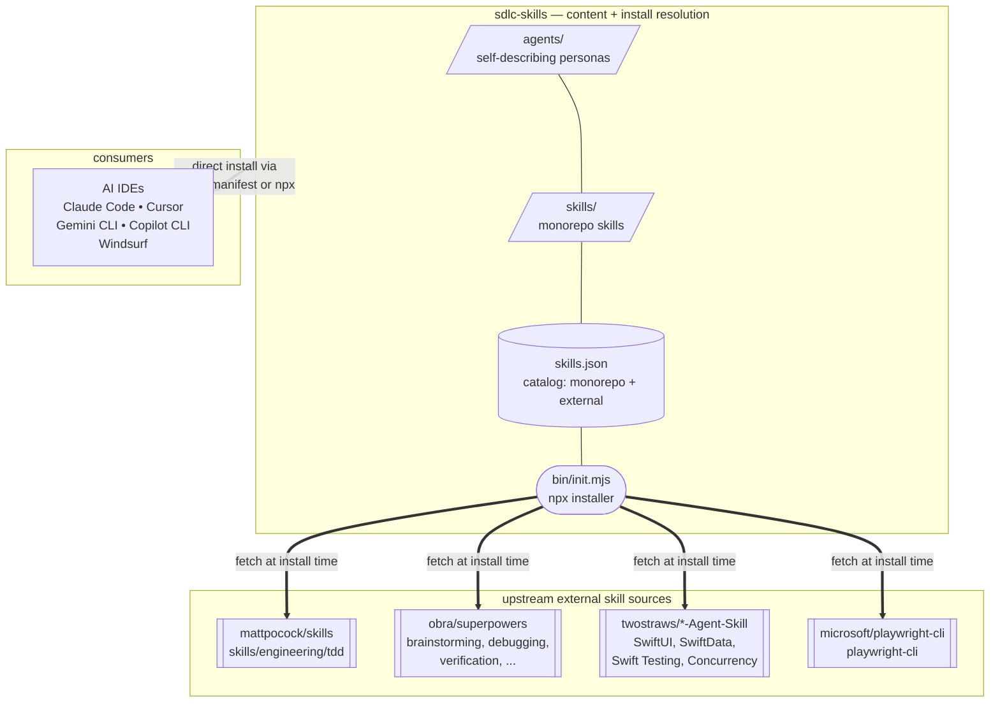

# sdlc-skills

**The content layer for AI-assisted software delivery.** Role-based agent
personas (BA, Tech Lead, PM, devs, QA, PA), workflow skills (TDD,
bugfix, code review, task completion, memory, …), and a registry that
pulls proven skills from Matt Pocock, Jesse Vincent (obra/superpowers),
and Paul Hudson so you don't have to reinvent them.

Install via the npx one-shot or a native plugin manifest and use the
agents + skills directly in any AI IDE (Claude Code, Cursor, Gemini CLI,
GitHub Copilot CLI, Windsurf, Codex).

## Architecture



(Node shapes convey grouping so colors aren't needed: `/ /` parallelograms
for content dirs, `( )` round-ended for the installer, cylinders for the
registry, `[[ ]]` subroutines for external sources. GitHub's Mermaid
renderer uses theme-adaptive colors in both light and dark mode.)

Agents are **self-describing** — each `agents/<name>/AGENT.md` carries
its own metadata (role, group, theme, aliases, skills, model). IDE plugin
systems read it at install time. Nothing duplicated.

External skills (Matt Pocock's `tdd`, Jesse Vincent's `brainstorming` /
`systematic-debugging` / etc., Paul Hudson's Swift skills) live in their
upstream repos. The installer resolves each agent's declared skill list
against `skills.json`, clones external repos on first install into
`~/.cache/sdlc-skills/registry/`, and copies the subdir into your project's
skills directory (or symlinks it with `--symlink`).

## What lands in your project

After `npx … init` + a scout run, your target project has two top-level
directories plus the IDE's native install location:

```
your-project/
├── .claude/                  ← IDE-native install (or .cursor/, .windsurf/, .github/)
│   ├── agents/<role>/        agent config (AGENT.md + SOUL.md)
│   └── skills/<name>/        skill content (SKILL.md + references)
│
├── .agents/                  ← IDE-neutral content — every agent reads
│   ├── profile.md            scout output: project card
│   ├── architecture.md       scout output: system design
│   ├── conventions.md        scout output: coding standards
│   ├── testing.md            scout output: test infrastructure
│   ├── team-comms.md         scout output: transport + roster
│   ├── onboarding.md         scout's audit trail
│   └── memory/<role>/        memory-skill dir: MEMORY.md index,
│                             curated entries (incl. scout-seeded
│                             project_briefing.md), daily/, snapshot.md
│
├── AGENTS.md                 scout output: full team reference
└── CLAUDE.md                 scout output: 80-line auto-loaded context
```

`.agents/` holds content every agent reads regardless of IDE. Nothing
in `.agents/` is host-specific — it works identically under Claude Code,
Cursor, Gemini CLI, Copilot CLI, and Windsurf.

Scout (`scout` agent, run once when onboarding) populates everything
under `.agents/` plus `AGENTS.md` / `CLAUDE.md` at the root. Re-run
scout whenever the stack evolves to refresh.

## Install — pick one path

There are really two paths: the **full experience** (npx installer) and
the **monorepo-only fallbacks** (native IDE plugins for people who don't
want to be happy).

| Path | Fetches external skills? | When to pick |
|---|---|---|
| **npx installer** ⭐ | ✅ Yes | Any IDE. Full catalog. One command. This is the happy path. |
| Native IDE plugins | ❌ Monorepo only | You don't want Node installed. Trade-off: no external skills, manual team assembly. |

> **Onboarding a test-automation pilot?** Existing framework, existing app,
> existing MCP connectors? See
> [`TEST-AUTOMATION-ONBOARDING.md`](TEST-AUTOMATION-ONBOARDING.md) for the
> end-to-end step-by-step: install → MCP inventory → scout seed →
> `.agents/test-automation.yaml` → single-case pilot → scale-up.

> **Why the split?** The native IDE plugin systems (Claude Code, Cursor,
> Gemini CLI, Copilot CLI) only see skills present in this repo's
> `skills/` directory — they don't know how to fetch from upstream. The
> npx installer reads `skills.json` and resolves external dependencies
> automatically (Matt Pocock's TDD, Jesse Vincent's debugging skills,
> Paul Hudson's Swift skills). If you want the full catalog, use the
> ⭐ path.

### 1. npx installer (recommended)

One command installs agents, their declared monorepo skills, and their
external skills together. Works for Claude Code, Cursor, Windsurf, GitHub
Copilot, and Codex (IDE targets detected automatically). Agents install in
each host's native form — directories for Claude/Cursor/Windsurf, flat
`.agent.md` for Copilot, TOML for Codex.

```bash
# A team bundle — the whole team in one shot (agents, their skills,
# per-role stack briefings, and team conventions). See bundles/SPEC.md.
npx github:arozumenko/sdlc-skills init --bundle team-web   # JS/TS frontend + Python backend
npx github:arozumenko/sdlc-skills init --bundle team-ios   # Swift / SwiftUI
npx github:arozumenko/sdlc-skills init --bundle web-qa     # manual-QA team (live browser testing via Playwright MCP)
npx github:arozumenko/sdlc-skills init --bundle test-automation  # TMS-driven automation pipeline (analyst → implementer → reviewer, led by Tal)
npx github:arozumenko/sdlc-skills init --bundle quality-engineering  # in-sprint testing — triage → curate → author → review → execute → report → triangulate (one seat per stage)

# Full catalog, all detected IDEs
npx github:arozumenko/sdlc-skills init --all

# A specific team — every declared skill comes along automatically
# (monorepo + external; externals are git-cloned then copied in — add --symlink to link instead)
npx github:arozumenko/sdlc-skills init --agents ba,tech-lead,ios-dev

# Specific skills (overrides the auto-resolve)
npx github:arozumenko/sdlc-skills init --skills bugfix-workflow,code-review

# Narrow to one IDE target
npx github:arozumenko/sdlc-skills init --agents ios-dev --target claude

# Update an existing install
npx github:arozumenko/sdlc-skills init --all --update
```

**Team bundles.** A bundle is a named team preset that installs a curated
set of agents (with their skills), seeds per-role stack briefings into
`.agents/memory/<role>/`, splices team conventions into `AGENTS.md` /
`CLAUDE.md`, applies per-role **skill overlays**, and can **seed reference
files** into the project — one command instead of hand-listing roles. Five
ship today:

| Bundle | Roster | What it's for |
|---|---|---|
| `team-web` | shared core + python-dev/js-dev + QA | JS/TS frontend + FastAPI/FastMCP backend delivery team |
| `team-ios` | shared core + ios-dev + QA | Swift / SwiftUI delivery team |
| `web-qa` | 6 bundle-local agents (app-profiler, test-sizer, test-author, test-run-lead, test-runner, test-reporter) | Manual-QA team — `app-profiler` onboards the app, then `test-run-lead` orchestrates a run: authoring (`test-author`) and sizing (`test-sizer`) cases when needed, running them live via Playwright MCP (`test-runner`), and reporting (`test-reporter`). Ships its own agents and seeds the test-case/report-format reference docs into `.agents/web-qa/knowledge/`. |
| `test-automation` | shared core (scout) + test-automation-engineer + qa-engineer + bundle-local `test-automation-lead` (Tal) | Automation-focused team — Tal orchestrates the analyst → implementer → reviewer pipeline, owns test-framework architecture and the automation merge gate. Pins `test-automation-workflow` + `test-case-analysis`; TMS-agnostic. |
| `quality-engineering` | scout + 6 bundle-local seats (`qe-lead`, `story-analyst`, `case-curator`, `test-author`, `test-runner`, `test-reporter` — reporter on haiku) | **In-sprint testing** with structural separation of duties — the lead orchestrates triage → **reuse-first case curation** (keep/update/rewrite/retire + regression scope, via `case-curation`) → author → cold review → execution (build-stamped evidence) → reporting → **bugfix verification** → **5-axis triangulation** (tested↔cases↔requirements↔functionality↔intent), one isolated seat per stage. No framework automation. Distinct from `web-qa` (in-sprint discipline + curation + triangulation vs pure run-execution). |

See [`bundles/SPEC.md`](bundles/SPEC.md) and each bundle's `README.md` to
author your own.

Install locations:

| Target | Directory | Drop path |
|---|---|---|
| Claude Code | `.claude/` | `.claude/agents/<name>/`, `.claude/skills/<name>/` |
| Cursor | `.cursor/` | `.cursor/agents/<name>/`, `.cursor/skills/<name>/` |
| Windsurf | `.windsurf/` | `.windsurf/agents/<name>/`, `.windsurf/skills/<name>/` |
| GitHub Copilot CLI | `.github/` | `.github/agents/<name>.agent.md` (flat file), `.github/skills/<name>/` |

**Copilot CLI note.** Copilot CLI expects agents as flat
`<name>.agent.md` files, not as directories. The installer handles this
automatically when `--target copilot` is selected: it flattens
`AGENT.md` + `SOUL.md` into a single file with a `## Persona` section,
and rewrites `model: sonnet` → `model: claude-sonnet-4.6` so Copilot CLI
picks a concrete model. The other targets keep the directory layout.

**Skills-inventory injection (non-Claude targets).** Claude Code
preloads each SKILL.md declared in the agent's `skills:` frontmatter
directly into the subagent's context at startup, so the agent already
has the skill content before it reads its own AGENT.md. Copilot CLI,
Cursor, and Windsurf have no documented preload — Copilot silently
discards unknown frontmatter keys. The installer fills the gap only
where it exists: for Copilot / Cursor / Windsurf targets, every
installed AGENT.md gets a bracketed `<!-- SKILLS-INJECTED: START -->`
section listing declared skills with their descriptions from
`skills.json`. Claude Code agents do not receive this section (it
would duplicate the preload). The block is idempotent on `--update` —
re-runs replace in place, never duplicate.

External skills are cloned once into the shared cache at
`~/.cache/sdlc-skills/registry/<owner>__<repo>/` (override with
`SDLC_SKILLS_CACHE_DIR` or `XDG_CACHE_HOME`), then **copied** into the
project's skills dir by default — so the install is self-contained and
portable (git, zip, Docker, Windows, and sandboxed/jailed agent runtimes
that don't follow symlinks all work). Pass **`--symlink`** to symlink from
the cache instead (a live link, dedups across projects) when your runtime
handles symlinks and you'd rather not duplicate the content.

Run `npx github:arozumenko/sdlc-skills init --help` for the full flag list.

### Repairing an existing Copilot CLI install — `fix-copilot`

If a project already has agents installed as directories under
`.github/agents/<name>/` (older sdlc-skills release, manual drop,
install from upstream before this fix landed), run:

```bash
npx github:arozumenko/sdlc-skills init fix-copilot
```

This scans `.github/agents/`, flattens each directory into
`<name>.agent.md`, and rewrites the `model:` line for Copilot
compatibility. Four modes for handling the paired `SOUL.md`:

| `--soul <mode>` | What happens to `SOUL.md` |
|---|---|
| `memory` (default) | Relocated to `.agents/memory/<name>/SOUL.md` (IDE-neutral per-role dir, co-located with memory-skill content); source directory removed; in-file reference rewritten as an `@`-prefixed auto-import (matches the existing `@.agents/memory/<name>/snapshot.md` convention) |
| `inline` | Appended as `## Persona` inside the flat agent file; source directory removed |
| `keep` | Left in place at `<name>/SOUL.md`; flat agent file's reference rewritten |
| `sibling` | Moved to `<name>.soul.md` next to the agent file; reference rewritten |

Add `--dry-run` to preview, or `--no-normalize-model` to keep the
original `model:` value. Full help: `init fix-copilot --help`.

### 2. Monorepo-only fallbacks (for when you refuse to install Node)

Each of these paths reads the native plugin manifest this repo ships and
installs **only the skills present in `skills/`** — external skills
(Matt Pocock's TDD, the superpowers skills, the twostraws Swift skills)
are not fetched. If you want those, go back to path 1.

**Claude Code plugin marketplace** — `.claude-plugin/marketplace.json`

```bash
/plugin marketplace add arozumenko/sdlc-skills
/plugin install sdlc-skills@sdlc-skills
# Or individual entries: /plugin install ios-dev@sdlc-skills  etc.
```

**Cursor native plugin** — `.cursor-plugin/plugin.json`

Point Cursor's plugin manager at this repo URL; it reads the manifest
and installs skills + agents from `./skills/` and `./agents/`.

**Gemini CLI extension** — `gemini-extension.json` + `GEMINI.md`

```bash
gemini extensions install https://github.com/arozumenko/sdlc-skills
```

The `GEMINI.md` context file catalogs every agent and skill for on-demand
loading.

**GitHub Copilot CLI / generic** — `AGENTS.md`

`AGENTS.md` at the repo root describes the content for any tool that
follows the AGENTS.md convention. Copilot CLI reads it when the repo is
cloned into your project.

### 3. agentskills.io / third-party consumption

Every skill under `skills/<name>/` follows the
[agentskills.io](https://agentskills.io) spec — `SKILL.md` with
`name` + `description` frontmatter. Any skill runtime (Vercel, custom
frameworks, other IDEs) can point directly at `skills/<name>/`.

## Catalog

### Agents (11)

| Agent | Persona | Role |
|---|---|---|
| `ba` | Alex | Business analyst — turns requirements into user stories with acceptance criteria |
| `tech-lead` | Rio | Decomposes user stories into technical tasks with dependencies; owns framework-scale decisions for test automation |
| `project-manager` | Max | Distributes tasks, tracks team state, escalates blockers, owns the merge gate |
| `python-dev` | Py | Python implementation — owns its own repo clone and branch |
| `js-dev` | Jay | JavaScript / TypeScript implementation — owns its own repo clone and branch |
| `ios-dev` | Io | iOS/Swift implementation — SwiftUI, SwiftData, Swift Testing (no simulator) |
| `qa-engineer` | Sage | Tests PRs, reports findings, executes TMS cases and emits Automation-Friendly Specs via the `test-case-analysis` skill |
| `test-automation-engineer` | Axel | Implements automation from AFS specs in the project's existing framework (Playwright / Cypress / pytest / JUnit / NUnit / WDIO) |
| `qa-analyst` | Quinn | Audits a running product across dimensions (a11y / security / privacy / performance / responsive / content-SEO / UX), runs persona review, and owns the quality bar; PM-dispatched shift-left gate |
| `scout` | Kit | Maps unfamiliar codebases — explores, documents patterns, flags risks |
| `personal-assistant` | Octo | Conversational assistant: vault, email, calendar, daily brief |

### Monorepo skills

**SDLC-coupled (9):**

| Skill | What it does |
|---|---|
| `plan-feature` | Feature planning workflow used by BA / Tech Lead |
| `implement-feature` | Feature implementation workflow used by devs |
| `bugfix-workflow` | Structured bug investigation: reproduce → root cause → fix → regression test |
| `reproducing-issues` | Turn a vague bug report into repeatable steps with a CONFIRMED / CANNOT-REPRODUCE / PARTIAL verdict (reproduction only) |
| `root-cause-analysis` | Trace a confirmed bug to its exact cause — execution-path tracing, classification, impact/regression (investigation only) |
| `test-case-analysis` | Execute a TMS case, capture stable selectors, flag defects, emit an Automation-Friendly Spec (AFS). Used by qa-engineer |
| `test-automation-workflow` | End-to-end test automation — explore → specify (AFS) → implement → review. Pluggable TMS adapters (Zephyr / TestRail / Xray / Azure / markdown) over HTTP or MCP |
| `seeding-a-project` | Scout's project onboarding / configuration flow |
| `completing-a-task` | Five-step task completion protocol: verify → commit → PR → comment → notify |

**Generic dev skills (16):**

| Skill | What it does |
|---|---|
| `code-review` | Structured code review checklist and reporting |
| `git-workflow` | Branching, commits, PR conventions |
| `playwright-testing` | E2E browser testing with Playwright |
| `browser-verify` | Quick visual / smoke verification in a browser |
| `issue-tracking` | GitHub / Linear / GitLab issue management |
| `xray-testing` | Xray CRUD + results import — Tests, Preconditions, Test Sets/Plans, Executions, Runs. Xray Cloud (GraphQL) + Server/DC (REST). Stdlib Python CLI fallback |
| `atlassian-content` | Jira issue/comment authoring (ADF, API v3) + Confluence pages (storage format) with accountId mentions and post-creation verification |
| `tosca-automation` | Tricentis TOSCA Cloud full lifecycle — TestCases, Modules (Html + SapEngine), Reusable Blocks, Playlists, Inventory/folders, TSU import/export. Bundled Typer CLI (`tosca_cli.py`) |
| `vividus` | Vividus BDD framework — bootstrap, configure, author `.story` files. 47+ plugins (web, REST, mobile/Appium, DB, messaging, AWS/Azure, visual, accessibility), BOM-pinned versions, suite/profile/environment triple, MCP-server grounding. Templates in `assets/` |
| `verifying-outcomes` | Verify a task actually achieved its stated goal |
| `gathering-context` | Targeted codebase exploration before changes |
| `deep-research` | Multi-source research and synthesis |
| `memory` | Persistent file-based memory across conversations |
| `obsidian-vault` | Read / write the user's Obsidian second brain |
| `microsoft-365` | Microsoft Graph (email / calendar / Teams) integration |
| `xlsx-reader` | Read `.xlsx` spreadsheets (test cases, checklists, requirement matrices) into Markdown for agent ingestion. Mirrored into the `web-qa` bundle as its primary consumer |

**Quality (11):** — the audit family is the `qa-analyst` (Quinn) toolkit (the dimensional leaves are agent-orchestrated, routed by `quality-audit-workflow`); `requirement-traceability` and `case-curation` anchor the `quality-engineering` bundle (its `story-analyst` / `case-curator` seats); `test-generation` serves both

| Skill | What it does |
|---|---|
| `quality-audit-workflow` | Multi-dimension quality-audit orchestration — modes, p0–p3 finding schema, specialist routing, persona review, reporting. Preloaded by `qa-analyst` |
| `accessibility-audit` | Accessibility & WCAG 2.1 AA/AAA — axe-core + visual review (contrast, ARIA, keyboard, focus) |
| `security-audit` | Web security — XSS, CSRF, headers (CSP / HSTS), mixed content, exposed secrets, OWASP Top 10 |
| `privacy-audit` | Privacy & GDPR — cookies, trackers, storage, consent banners |
| `performance-audit` | Performance — Core Web Vitals, network waterfall, console errors, JS issues |
| `responsive-audit` | Responsive / mobile-web — touch targets, viewport, overflow, breakpoints (CDP emulation) |
| `content-seo-audit` | Content & SEO — copy quality, meta tags, structured data, headings, links |
| `ux-audit` | UI/UX & page types — forms, error messaging, 20+ page-type patterns |
| `test-generation` | Coverage-gap proposal — candidate scenarios from a live page / findings (hands off to AFS, never framework tests) |
| `requirement-traceability` | Story triage (testability → gaps & questions) + 5-axis triangulation: coverage (uncovered / orphan / stale / weak-evidence) plus spec-deviation and intent-gap validation. Anchors the `quality-engineering` bundle |
| `case-curation` | Assess the existing case base against a story — match cases to ACs, classify keep / update / rewrite / retire / missing, surface case-vs-story contradictions, emit a minimal authoring delta + a regression scope. Reuse before you write |

### External skills (fetched by the installer)

Declared in `skills.json` with `repo:` + optional `subdir:`. The npx
installer clones each into `~/.cache/sdlc-skills/registry/` on first
install and copies the subdir into your project's skills dir (or symlinks
it with `--symlink`). Native
IDE plugin paths do **not** fetch these — use the installer for the full
catalog.

| Skill | Source | Used by |
|---|---|---|
| `tdd` | [`mattpocock/skills`](https://github.com/mattpocock/skills) → `skills/engineering/tdd/` | `python-dev`, `js-dev`, `ios-dev` |
| `brainstorming` | [`obra/superpowers`](https://github.com/obra/superpowers) → `skills/brainstorming/` | `ba` |
| `systematic-debugging` | [`obra/superpowers`](https://github.com/obra/superpowers) → `skills/systematic-debugging/` | devs + `qa-engineer` |
| `verification-before-completion` | [`obra/superpowers`](https://github.com/obra/superpowers) → `skills/verification-before-completion/` | devs + `qa-engineer` |
| `requesting-code-review` | [`obra/superpowers`](https://github.com/obra/superpowers) → `skills/requesting-code-review/` | devs |
| `receiving-code-review` | [`obra/superpowers`](https://github.com/obra/superpowers) → `skills/receiving-code-review/` | devs |
| `writing-skills` | [`obra/superpowers`](https://github.com/obra/superpowers) → `skills/writing-skills/` | `tech-lead` |
| `subagent-driven-development` | [`obra/superpowers`](https://github.com/obra/superpowers) → `skills/subagent-driven-development/` | `project-manager` |
| `dispatching-parallel-agents` | [`obra/superpowers`](https://github.com/obra/superpowers) → `skills/dispatching-parallel-agents/` | `project-manager` |
| `swiftui-pro` | [`twostraws/SwiftUI-Agent-Skill`](https://github.com/twostraws/SwiftUI-Agent-Skill) | `ios-dev` |
| `swiftdata-pro` | [`twostraws/SwiftData-Agent-Skill`](https://github.com/twostraws/SwiftData-Agent-Skill) | `ios-dev` |
| `swift-testing-pro` | [`twostraws/Swift-Testing-Agent-Skill`](https://github.com/twostraws/Swift-Testing-Agent-Skill) | `ios-dev` |
| `swift-concurrency-pro` | [`twostraws/Swift-Concurrency-Agent-Skill`](https://github.com/twostraws/Swift-Concurrency-Agent-Skill) | `ios-dev` |
| `playwright-cli` | [`microsoft/playwright-cli`](https://github.com/microsoft/playwright-cli) → `skills/playwright-cli/` | `qa-engineer`, `test-automation-engineer` |
| `playwright-best-practices` | [`currents-dev/playwright-best-practices-skill`](https://github.com/currents-dev/playwright-best-practices-skill) | `qa-engineer`, `test-automation-engineer`, `web-qa` agents |
| `fastapi` | [`fastapi/fastapi`](https://github.com/fastapi/fastapi) → `fastapi/.agents/skills/fastapi` | `team-web` overlay (`python-dev`, `tech-lead`) |
| `fastmcp-server` | [`davila7/claude-code-templates`](https://github.com/davila7/claude-code-templates) | `team-web` overlay |
| `vercel-react-best-practices` | [`vercel-labs/agent-skills`](https://github.com/vercel-labs/agent-skills) → `skills/react-best-practices` | `team-web` overlay (`js-dev`, `tech-lead`) |
| `environment-setup-xcuitest` | [`appium/skills`](https://github.com/appium/skills) → `skills/environment-setup-xcuitest` | `team-ios` overlay (`qa-engineer`) |
| `xcuitest-real-device-config` | [`appium/skills`](https://github.com/appium/skills) → `skills/xcuitest-real-device-config` | `team-ios` overlay (`qa-engineer`) |
| `appium-troubleshooting` | [`appium/skills`](https://github.com/appium/skills) → `skills/appium-troubleshooting` | `team-ios` overlay (`qa-engineer`) |

## Using these agents and skills

These agents and skills install cleanly into Claude Code, Cursor,
Windsurf, Copilot CLI, and Codex. A BA can draft stories, a tech-lead can
review a PR, `plan-feature` and `bugfix-workflow` run end-to-end with
just `git` and `gh`.

**Context auto-injected at session start (via the `hooks/` scripts):**

- `.agents/memory/<role>/snapshot.md` — each role's persistent memory,
  injected per dispatch by the `agent-start` hook on Claude Code, Codex,
  and Copilot CLI (their per-agent start hooks); re-fires on every
  dispatch, so it survives `/clear` and compaction.
- `.agents/role-overrides.md`, `profile.md`, `workflow.md`, `testing.md`,
  `conventions.md`, `team-comms.md` — lean shared project context, injected
  by the `session-start` hook (parent session) and by `agent-start` (each
  dispatched subagent, which gets a fresh context), re-injected after
  `/clear` or compaction. Big manuals (`AGENTS.md`, `docs/`) are not
  injected — agents read those on demand.

A missing file is skipped (safe on first run). On Cursor (whose
`subagentStart` is permission-only) and Kiro (whose `agentSpawn` carries
no agent name), the `session-start` hook adds a roster reminder pointing
each role at the `memory` skill instead. See
[`hooks/README.md`](hooks/README.md) for wiring and the portability matrix.

Every agent works as a subagent dispatched by the host IDE. Every
`skills/<name>/` skill is self-contained. Developer agents work on your
working tree; coordinate merges manually when multiple devs are active.

## Repository layout

```
sdlc-skills/
├── .claude-plugin/
│   ├── plugin.json             # Claude Code plugin metadata
│   └── marketplace.json        # Claude Code marketplace entry list
├── .cursor-plugin/
│   └── plugin.json             # Cursor native plugin manifest
├── agents/                     # role-based personas (self-describing)
│   └── <agent-name>/
│       ├── AGENT.md            # frontmatter (group, theme, aliases, skills) + instructions
│       └── SOUL.md             # personality / voice / working style
├── skills/                     # agentskills.io-compliant skills
│   └── <skill-name>/
│       ├── SKILL.md            # frontmatter: name + description
│       ├── references/         # optional supporting docs
│       └── scripts/            # optional helper scripts
├── bin/
│   ├── init.mjs                # npx installer — resolves + fetches externals
│   └── validate-bundles.mjs    # bundle manifest validator (CI + npm run validate:bundles)
├── bundles/                    # team presets — one command installs a whole team
│   ├── SPEC.md                 # bundle manifest spec
│   └── <bundle-id>/            # team-web, team-ios, web-qa, test-automation
│       ├── bundle.json         # roster, briefings, skillOverlays, seed, instructions
│       ├── README.md           # roster + install
│       ├── instructions.md     # spliced into AGENTS.md / CLAUDE.md
│       ├── briefings/<role>.md # seeded into .agents/memory/<role>/ (team-web/ios)
│       ├── knowledge/          # reference docs seeded into the project (web-qa)
│       └── agents/<name>/      # bundle-local agents (web-qa)
├── skills.json                 # catalog: monorepo + external skill sources
├── AGENTS.md                   # generic / GitHub Copilot CLI fallback
├── GEMINI.md                   # Gemini CLI context file
├── gemini-extension.json       # Gemini CLI extension manifest
├── package.json                # bin: { init: ./bin/init.mjs }
├── LICENSE
└── README.md
```

## Adding content

1. **New agent** → create `agents/<name>/AGENT.md` (with YAML frontmatter:
   `name`, `description`, `model`, `color`, `group`, `theme`, `aliases`,
   `skills`) and `agents/<name>/SOUL.md`. No separate registry needed.
2. **New monorepo skill** → create `skills/<name>/SKILL.md` with
   agentskills.io frontmatter (`name`, `description`). Supporting files
   go in `skills/<name>/references/` or `skills/<name>/scripts/`. Register
   in `skills.json` with `{"id": "<name>", "monorepo": "sdlc-skills",
   "name": "<name>"}`.
3. **New external skill** → register in `skills.json` with
   `{"id": "<name>", "repo": "owner/repo", "ref": "main", "subdir": "path/to/skill"}`.
   The installer will clone + copy on first install (or symlink with `--symlink`).
4. **Reference the new skill in an agent's `skills:` list** —
   the installer auto-resolves it on the next run.

No build step, no generated manifests. The installer discovers agents
at runtime (`listDirs("agents")`) and reads `skills.json` for skill
resolution — add a folder or a registry entry, it shows up on the next
`init` run.

## Acknowledgements

External skills are fetched from upstream at install time — this repo
re-distributes nothing, only catalogs and wires.

- **[`mattpocock/skills`](https://github.com/mattpocock/skills)** — Matt Pocock. `skills/engineering/tdd/` (vertical-slice tracer bullets, integration-style tests, interface design for testability). MIT.
- **[`obra/superpowers`](https://github.com/obra/superpowers)** — Jesse Vincent. `brainstorming`, `systematic-debugging`, `verification-before-completion`, `requesting-code-review`, `receiving-code-review`, `writing-skills`. MIT.
- **Paul Hudson's Swift agent skills** — [`twostraws/SwiftUI-Agent-Skill`](https://github.com/twostraws/SwiftUI-Agent-Skill), [`twostraws/SwiftData-Agent-Skill`](https://github.com/twostraws/SwiftData-Agent-Skill), [`twostraws/Swift-Testing-Agent-Skill`](https://github.com/twostraws/Swift-Testing-Agent-Skill), [`twostraws/Swift-Concurrency-Agent-Skill`](https://github.com/twostraws/Swift-Concurrency-Agent-Skill). Powers the `ios-dev` agent. MIT.
- **[`microsoft/playwright-cli`](https://github.com/microsoft/playwright-cli)** — Microsoft Playwright. `skills/playwright-cli/` (drive Playwright from the command line — browser launch, navigation, snapshot/locator interaction, tabs and storage, network mocking, tracing, test generation). Used by `qa-engineer` and `test-automation-engineer`. Apache-2.0.
- **[`fastapi/fastapi`](https://github.com/fastapi/fastapi)** — Sebastián Ramírez. Official FastAPI agent skill. `team-web` backend overlay. MIT.
- **[`appium/skills`](https://github.com/appium/skills)** — Appium. XCUITest environment setup, real-device config, and troubleshooting. `team-ios` QA overlay. Apache-2.0.
- **Bundle-overlay / QA skills** also fetched from [`currents-dev/playwright-best-practices-skill`](https://github.com/currents-dev/playwright-best-practices-skill) (Playwright selector/wait guidance), [`vercel-labs/agent-skills`](https://github.com/vercel-labs/agent-skills) (React best practices), and [`davila7/claude-code-templates`](https://github.com/davila7/claude-code-templates) (`fastmcp-server`) — see each repo for its license.

Thanks to all maintainers.

## License

MIT — see [LICENSE](./LICENSE).
