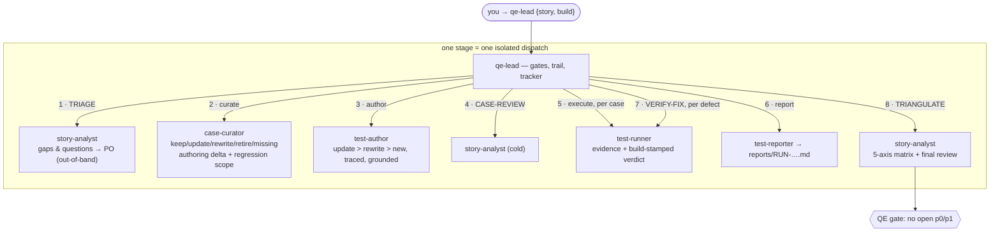

# Quality Engineering Team

An **in-sprint testing team** with structural separation of duties. It takes a
story from requirement intake to a triangulated verdict on the build: challenge
the requirements, **curate the existing case base before writing anything new**,
author/update traced cases, execute by exploration, verify bugfixes with fresh
evidence, and run the **5-axis triangulation** at the end. Every stage is a
distinct single-purpose agent in an isolated dispatch — the author never
executes, the executor never grades itself, the reviewer arrives cold.

> **Not** the `web-qa` team. `web-qa` is a standalone run-execution machine —
> assemble a suite, run it live, report. `quality-engineering` wraps that kind
> of machine with the in-sprint discipline web-qa deliberately doesn't have:
> requirement triage, **reuse-first case curation** (update/rewrite instead of
> re-authoring), regression scoping, bugfix verification, and
> requirement↔case↔result↔functionality↔intent triangulation. Use `web-qa` to
> *run a suite*; use `quality-engineering` to *test a story in-sprint and prove
> it does what was asked*.

## Install

```bash
npx github:arozumenko/sdlc-skills init --bundle quality-engineering
```

Installs the 7 agents below, their skills, the scout briefing, the QE knowledge
docs (case format/template, run-report format, traceability matrix) into
`.agents/quality-engineering/knowledge/`, and splices the team conventions into
`AGENTS.md` / `CLAUDE.md`.

## Roster

| Seat | Model | Does |
|---|---|---|
| `qe-lead` | sonnet | **The orchestrator** — dispatches every seat via the Agent tool, owns the gates, the **audit trail** (`reports/trail/`), and the tracker (questions to the PO out-of-band, defects from runner evidence). You talk only to the lead. |
| `story-analyst` | sonnet | **The analytical seat** — three modes, one per dispatch: TRIAGE (assemble the full story dossier — ticket anatomy + linked Confluence specs + similar-ticket search, bounded by relevance with an escalation valve — then challenge the story, rt Phase 0), CASE-REVIEW (cold review of authored cases), TRIANGULATE (5-axis matrix + independent final review). Never authors, never executes. |
| `case-curator` | sonnet | **The reuse-first seat** — inventories the existing case base (TC files / xlsx / TMS), matches cases to ACs by reading steps, classifies **keep / update / rewrite / retire / missing**, surfaces case-vs-story contradictions, emits the **minimal authoring delta** + the **regression scope** (via the `case-curation` skill). |
| `test-author` | sonnet | Delivers the delta — updates in place (id preserved), rewrites under the same id, new cases only for true gaps; every case cites `requirements:`; steps grounded by exploring the implemented build. |
| `test-runner` | sonnet | EXECUTE — one dispatch per **session group** (state-compatible cases share one live session with **verified inheritance**; mismatch → full-reset fallback), per-case build-stamped JSON verdicts — or VERIFY-FIX (original repro re-run on the new build with fresh evidence + regression neighbors). |
| `test-reporter` | **haiku** | Aggregates runner JSONs into `reports/{run_id}.md` — build stamps and requirement traces mandatory; failure classification; anomaly sections. |
| `scout` | sonnet | Onboards the project — `.agents/*.md` (profile, testing, workflow, **team-comms**) the hooks inject into every dispatch. |

## How a story flows



The same `story-analyst` seat legitimately runs stages 1, 4, and 8 — it never
produces cases or results, so its reviews stay independent by construction. The
curator, author, and runner are always different seats from each other and from
the analyst.

### The 5-axis triangulation

1. **Tested vs cases** — every case actually executed, on the current build? *(stale / unexecuted)*
2. **Cases vs requirements** — every AC has a case; every case traces. *(uncovered / orphan)*
3. **Results vs requirements** — does each pass *prove* its AC? *(weak-evidence)*
4. **Functionality vs requirements** — does the build match the written requirement? *(spec deviation — reported)*
5. **Delivered vs intended** — does what shipped match what was asked? *(intent gap — surfaced as an observation)*

Axes 1–3 are read off the matrix (seeded template in `knowledge/`); axes 4–5
are validation observations — QE reports them and never edits requirements.

## What this bundle adds

- **Agents** — the 6 bespoke seats above (bundle-local, web-qa-style: compact
  bodies, scoped tools, per-seat models) + the shared `scout` (mirror).
- **The `case-curation` skill** — canonical (`skills/case-curation/`), the
  curator's methodology: reuse-first classification, contradiction classes,
  authoring delta, regression scoping.
- **Skills** — `requirement-traceability` (triage + 5-axis triangulation),
  `verifying-outcomes`, `test-generation`, `playwright-testing` +
  `playwright-cli` + `playwright-best-practices` (the runner's browser ladder),
  `browser-verify`, `reproducing-issues`, `verification-before-completion` +
  `systematic-debugging` (runner/lead execution discipline), `issue-tracking`
  (+ `atlassian-content` for Jira/Confluence — the lead writes with it, the
  story-analyst reads Confluence specs + searches similar tickets with it),
  `xlsx-reader`, scout's seeding set, `memory`.
- **Seeded knowledge** — [`knowledge/`](knowledge/) → `.agents/quality-engineering/knowledge/`:
  the **case format + template** (mandatory `requirements:`, optional
  state contracts), the **run-report format** (mandatory build stamps +
  traces), the **session-plan format** (state-contract grouping — design
  adapted from the web-qa mobile-testing skill, PR #40), and the
  **traceability-matrix** working template.
- **Instructions** — [`instructions.md`](instructions.md) → spliced into `AGENTS.md` / `CLAUDE.md`.
- **Briefings** — scout only; the bespoke seats carry their procedure in their own bodies.
- **Hooks** — _(none beyond the core context hooks every install gets)._

See [`bundle.json`](bundle.json) for the manifest and [`../SPEC.md`](../SPEC.md)
for how bundles are defined and installed.
