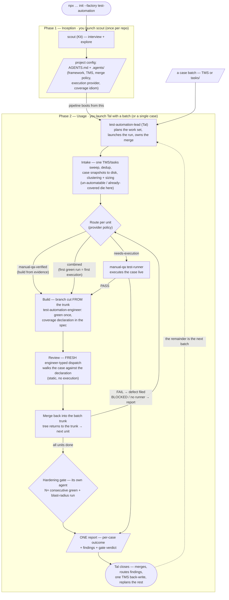

# Test Automation Team (`test-automation`)

A **universal** three-agent team that **compiles ready-made test cases into
merged, honest automated tests** — across **any framework, any test type (UI,
API, mobile, performance, …), and any TMS.** Input: cases from the TMS or from
`tasks/<suite>/TC-*.md` (the manual-qa factory's format), plus execution
evidence when it exists. Output: merged test code, a TMS back-write, and
receipts. Writing cases and executing them live belong to the **manual-qa**
factory — co-installing the two is a first-class scenario, and standalone
(cases straight from the TMS) is equally first-class.

The team is quiet: the only repo artifacts it produces are **test code** and
the **surface cache** (`.agents/automation/surface/<feature>.md` — accreted
handles, waits, quirks). Batch state — case snapshots, the report, `cost.json`
— lives under `.agents/automation/<slug>/`.

## Install

```bash
npx github:arozumenko/sdlc-skills init --factory test-automation
```

Drops the three agents into the host's agent dir (`.claude/agents/`,
`.github/agents/`, …), installs their libraries (`test-automation-workflow`,
`test-automation-implementation`, …) on disk, wires the memory/context hooks,
and splices `instructions.md` into `AGENTS.md`.

## How the factory is built to behave the same on every host

Three kinds of content, each with exactly one home and one delivery channel:

| Kind | Home | Reaches the agent via |
|---|---|---|
| **Standing rules** — everything a role must always do (its loop, its contract, the Hard Rules, the Run Report, the host rules) | the role's `AGENT.md` | the host itself: Claude Code, Copilot CLI, VS Code Copilot Chat and Codex all read the agent file natively. `SOUL.md` (persona) and `RULES.md` (a ≤10-line verbatim echo of AGENT.md, enforced by `npm run validate`) are injected at dispatch by the shared hooks on every host. |
| **Project facts** — framework, provider policy, coverage idiom, conventions, branch policy | `.agents/*.md`, `.agents/test-automation.yaml` (seeded by scout) | the shared hooks: inlined on Claude Code, mirrored to `.github/instructions/*.md` on Copilot |
| **Reference material** — TMS adapters, scaffolds, reviewer contract, investigation and defect-filing detail, Claude Workflow scripts | the two library skills' `references/` and `scripts/` | opened by name at the step the agent body names; **never assumed to be in context** — `skills:` is empty on all three roles, every library sits in `skills-on-demand:` |

The consequence is that no rule depends on a host feature: no preload, no
Workflow tool, no background notifications, no hook that might not fire. The
unit of work is one synchronous dispatch that returns one Run Report; a batch is
that loop N times, and Claude Code's shipped workflow scripts merely run it
faster. Five host rules sit verbatim in the lead's and the engineer's bodies:
nothing wakes a waiting agent; one unit per dispatch; images stay on disk (text first, a
picture only when it answers what text cannot, never the same one twice); exit only with a Run Report; a dead dispatch is split,
never retried with the same prompt.

## Roster

| Role | Agent | Source | Job |
|---|---|---|---|
| Onboarding | `scout` (Kit) | factory-local | Seeds framework / TMS adapter / base branch / merge policy into `.agents/` — plus the **execution provider** (`manual-qa` \| `self`) and the **coverage idiom** into `.agents/testing.md`. |
| Lead / orchestrator (PM + tech-lead combined) | `test-automation-lead` (Tal) | factory-local | Takes work in (cases, a story's acceptance criteria, tech tasks), runs the unit loop — build → static review → prove → merge → mirror — owns framework architecture + the automation merge. The user launches Tal directly. |
| Implementer + reviewer | `test-automation-engineer` (Axel) | factory-local | Derives what to build straight from the case, writes the code, files defects. The **reviewer slot** is a fresh engineer-typed dispatch (clean context + `code-review` + the reviewer contract) — independence comes from the contract, not from a different agent file. |

**`qa-engineer` (Sage) is removed.** Its functions re-homed: live case
execution → manual-qa (or the engineer's combined mode standalone); screening
→ the lead's sizing at take-in; spec derivation → the engineer's build
dispatch; review → the fresh engineer-typed reviewer dispatch; defect filing →
the engineer ("file and walk away"). **Migrating an existing install:** after
`init --update`, re-run scout — its migration pass sweeps
`.agents/memory/qa-engineer/` through `knowledge-curation` (promote what
passes the admission tests, then the dir can go) and leaves legacy
`test-specs/` AFS files alone — the new pipeline ignores them.

## Co-install with manual-qa

Division of labor: **manual-qa writes cases and executes them live; TA
automates them.** Running TA's *own* code (hardening gate, blast-radius
regression) stays in TA — that is proving code, not executing cases.

**Installing the pair** — the ideal setup is both factories in one repo, two
sequential runs (factories are additive by construction; these two share no
agent or skill id, so order does not matter — manual-qa first only means
scout's first seeding already sees it):

```bash
npx github:arozumenko/sdlc-skills init --factory manual-qa --target claude --yes
npx github:arozumenko/sdlc-skills init --factory test-automation --target claude --yes
```

Then onboard each front once: `app-profiler` (manual-qa's app interview +
live exploration) and `scout` (TA's repo seeding — it detects manual-qa and
sets the provider policy below). Each factory keeps its own hook scripts and
instruction block, and their metrics hooks are roster-guarded, so neither
fires in the other's sessions. **Adding manual-qa to an existing TA install
later** works too: install it, then re-run scout (`init --update` + re-seed)
so `.agents/testing.md § Execution provider` flips from `self` to
`manual-qa` — until it does, the pipeline keeps self-executing by policy.

> **Co-install with feature-development — a real caveat.** manual-qa and this
> factory share **zero** agent/skill ids; feature-development shares three:
> `scout`, `test-automation-engineer`, and the `test-automation-workflow`
> skill — and the installer keeps the FIRST-installed copy of a shared id.
> FD's copies still tell the v1 story (AFS, analyst slot), so on a hybrid
> repo install feature-development first, then this factory with `--update`
> (its copies win the shared ids), or pin explicitly
> (`--skills test-automation/test-automation-workflow`). Symptoms of the
> wrong order: `references/coverage-contract.md` missing from the installed
> workflow skill, the engineer asking for an AFS. Tal checks for this at
> session start. Scout note: if FD's scout copy owns the id, run the
> `seeding-automation-project` skill directly — it installs under its own
> id regardless and seeds `§ Execution provider` / `§ Coverage idiom`.

| Area | Owner | TA access |
|---|---|---|
| `tasks/` (cases) · `reports/` (run records) · `.agents/manual-qa/` | manual-qa | **read-only** — warm start for locators, app map, fragile areas; reference, never copy |
| test code · `.agents/automation/surface/` | test-automation | owns |
| `.agents/knowledge/` | shared | **two-way**, via the `knowledge-curation` skill — the only cross-factory write channel |

Which routes a batch uses degrades gracefully with what's installed —
scout detects the co-install at seeding and records the policy in
`.agents/testing.md § Execution provider`:

| Install | Provider | Routes in play |
|---|---|---|
| standalone (or no § Execution provider seeded) | `self` | `combined` for everything — the first green run of the automated test **is** the case's first execution; the engineer may walk the scenario live first when the surface is new, files a defect when the scenario does not work in the product, and probes rather than walks once the surface cache answers |
| co-install | `manual-qa` | `manual-qa-verified` — PASS run record + authored case exist → build from that evidence, **no re-execution**, cite the run id; otherwise `needs-execution` — Tal dispatches manual-qa's `test-runner` per case (PASS → build; FAIL → defect filed, case not automated until fixed; dispatch impossible → the unit *stays* `needs-execution` and the report says run the manual-qa suite first — **never** a silent fallback to self-execution) |

## Quick start

The pipeline runs in **three phases**. You launch `scout` once, then drive
**Tal** directly for every automation task. Launch each as your **main agent**
straight from the terminal (Claude Code):

```bash
claude --agent scout                 # Phase 1 — seed the repo (once)
claude --agent test-automation-lead  # Phase 2+ — drive every automation task
```

GitHub Copilot CLI finds the same agents in `.github/agents/` on its own, and
reads the repo-root `.mcp.json` as workspace servers — no extra wiring. Add
`--yolo` (or at least `--allow-all-tools`), or an orchestrator that dispatches
subagents stalls on every confirmation. **Non-interactive `-p` runs load the
repo's `.github/hooks` — and with them every agent's memory and project
context — only when the folder is trusted or an opt-in env var is set:**
`GITHUB_COPILOT_PROMPT_MODE_REPO_HOOKS=true` (or `COPILOT_ALLOW_ALL=true`), or
confirm folder trust once in an interactive `copilot` session. The CLI flags
do not count; without the opt-in the hooks are skipped silently (only a
`--log-level debug` line says so). In the VS Code extension, pick the agent in
the chat panel and switch the session to auto-approve/bypass first.
Full per-host detail: [onboarding § Launching the agents](../../docs/onboarding/test-automation.md#launching-the-agents--run-them-as-your-main-agent).

**Before Phase 1 — two prerequisites.** scout's tool-wiring inspects the
**live MCP servers + installed skills** on the host, so wire those *before*
scouting: **(A)** install any project-specific skills the roster doesn't
declare — `npx skills find <tech>` or the registry catalogue
([`skills.json`](../../skills.json)) — and **(B)** wire MCP / connectivity in
the **host** (never the repo): `init --factory test-automation --interactive`
or `--mcp playwright,atlassian,onetest,elitea-next`. Full detail:
[onboarding § Prerequisites](../../docs/onboarding/test-automation.md#before-you-seed).

**Phase 1 — Inception (`scout`, once per repo).** Tell it: _"Onboard this
repo for the test-automation workflow."_ It asks what it can't infer, explores
the repo, then generates the project config — `AGENTS.md` plus the `.agents/`
set: framework, TMS adapter, base branch, merge policy, credential matrix,
execution provider, coverage idiom, and a per-role briefing under
`.agents/memory/<role>/`. Skip it and Tal still **self-orients** — he runs the
same `seeding-automation-project` skill himself — but a deliberate scout pass
is richer. Plain language works; scout asks for whatever's missing:

> Onboard this repo for the test-automation workflow. We track work in Jira,
> project `PLAT`. Test cases live in Zephyr Scale, same project key. I'll drop
> you case IDs to automate — file each as a sub-task under our `PLAT-4200`
> automation epic; bugs as their own tickets with the case ID linked. After a
> run, push pass/fail back to the Zephyr Scale execution record. PRs branch
> off `develop`; auto-merge once review green. Ask me about anything else.

For a shop where the manual-qa factory authors the cases:

> Onboard this repo. No separate TMS — test cases live as markdown under
> `tasks/`, run records under `reports/` (our manual-qa team writes both).
> File each automation task as its own GitHub issue under the `Automation`
> milestone. Auto-merge is fine.

**Phase 2 — Usage (Tal runs the unit loop).** Drop work on him — cases, a
story with acceptance criteria, a tech task: _"Automate TC-1234, TC-1235,
TC-1236."_ He reads each in full, dedups against merged specs and the
tracker, snapshots external bodies to disk, sizes each unit himself
(un-automatable and already-covered verdicts are made **here**, before any
build), routes it (`manual-qa-verified` / `needs-execution` / `combined` —
table above), and runs the loop **one unit at a time**: the engineer builds on
the unit's branch (green once, PR open, coverage declaration in the spec) → a
**fresh engineer-typed reviewer** walks the case step-by-step against that
declaration (static unless asked to re-run) → fix rounds until approved → the
**gate** — its own agent, never the one who wrote the code — runs the unit's
specs N consecutive green (default 3), the specs a modified symbol reaches
once, the coverage-grammar grep and the CI-selection check → merge per the
project's PR policy → tracker and TMS mirrored (automation executions only).
One report per batch; whatever didn't land is replanned. On Claude Code, when
you or the seed ask for a batch to run as a workflow, the shipped scripts run
the same loop on a batch trunk with one machine-readable report.

**Not just cases.** Tech-debt, migrations, framework improvements and suite
health run the **same loop** — a [tech-task brief](skills/test-automation-workflow/references/tech-task-brief.md)
takes the case's place as the unit contract. For scale beyond a single batch,
batches compose into **campaigns**:
[`campaign-planning.md`](skills/test-automation-workflow/references/campaign-planning.md).

**Phase 3 — Reinforcement (assisted; owned by `scout`, not Tal).**
**Replay is automatic** — the hooks re-inject each role's memory snapshot and
the shared `.agents/*` config at every dispatch (survives `/clear`,
compaction, resume). **Capture is assisted** — agents route what they learn
(see [Knowledge routing](#knowledge-routing)), and you periodically re-run
`scout` to refresh the shared config + briefings: it mines code, PR history,
and (via `session-retrospective`) past agent sessions, proposes the delta,
and **waits for your ack**.

**Phase 0 (optional) — Scoping.** Need a cost/time estimate *before*
committing — presales, a proposal? That's scout's `automation-scoping` skill:
works from case text alone, from a sample of a larger backlog, refined with a
live check when access exists (with the manual-qa factory present it reads
their `app_profile.md` / dispatches `app-profiler` instead of probing itself),
recalibrated against delivered-case history once one exists. Always a range
with a stated confidence, never a bare number. Its verdicts double as the
**exclusion budget** the reviewer later cross-checks.

**What it costs (measured, not remembered).** Ask _"what did this batch
cost?"_ and the `efficiency-audit` skill breaks metered spend down per
session, role, day and sub-agent, joined to the run report for **cost per case
delivered**. The `tokenomics` skill ships too: once its capture hooks are
enabled (opt-in), every batch gets an automatic
`.agents/automation/<slug>/cost.json` plus markdown/HTML views via
`team-report.mjs --batch <slug>`.

**A kickstarter, not a locked product.** Everything installed is plain files —
but tune the **project knowledge** (`.agents/`, via scout or a plain ask), not
the agent files: that keeps your install cleanly updatable with
`init --update`. Fork agents/skills only to contribute back or deliberately
diverge.

### How it flows

The diagram shows the batch shape as the Claude Code workflow runs it (batch
trunk, one hardening gate, one report). A single unit — the everyday case on
any host — runs the same loop on its own branch with its own gate and merges
per the project's PR policy.



## The coverage contract

Two sources of truth remain: **the case** (TMS or `tasks/` file — TA never
edits it) and **the code**. The contract binds them. Every delivered spec file
carries, in a comment block, a machine-findable declaration in a fixed
grammar:

```
TC-1234 coverage: steps 1-6, 8
TC-1234 excluded: 7 (un-automatable: captcha — no test hook), 9 (covered-elsewhere: test_password_reset_api)
```

Invariants: the case id appears in the test's identity; every case step traces
to an assertion or an explicit exclusion; exclusions use a **closed
vocabulary**, each category requiring a verifiable referent —
`covered-elsewhere` (name of the covering test), `blocked-by-defect` (defect
id), `un-automatable` (automation-scoping taxonomy category),
`by-seeded-policy` (the policy line in `.agents/testing.md`). Free-text
reasons ("flaky", "hard") are invalid grammar and block at review and gate.
The reviewer walks the case step-by-step and **touches every referent**; the
gate greps the mechanical part. The framework idiom on top (`test.step()`,
docstrings, `@DisplayName`, …) is picked by scout at seeding and recorded in
`.agents/testing.md § Coverage idiom` — the baseline comment block is always
present regardless. Full grammar + enforcement: the
`test-automation-workflow` skill.

## Knowledge routing

| What | Where |
|---|---|
| Hot handles, waits, quirks (high churn) | `.agents/automation/surface/<feature>.md` — TA's working cache; everything learned live goes back in |
| Durable, verified, cross-role system facts | promote to `.agents/knowledge/` via `knowledge-curation` (admission: cross-role + verified + durable + costly to rediscover) |
| Process / personal lessons | `.agents/memory/<role>/` via the `memory` skill |
| manual-qa's `.agents/manual-qa/**` | read-only warm start — before writing an app fact to the surface cache, check their knowledge/; if present, **reference it, never copy** (copies drift) |

## Skills — removed in v2

- `test-case-analysis` — the AFS layer it produced is gone; the surviving
  execution/investigation discipline, defect filing, and surface-cache
  mechanics moved into `test-automation-implementation/references/`.
- `playwright-testing` (TA copy) — its POM + fixtures patterns moved to
  `test-automation-implementation/references/playwright-patterns.md`; dropping
  the copy also fixes the co-install collision with manual-qa's superior
  execution copy.
- `bugfix-workflow` — a dev skill; TA files defects and walks away. It lives
  on in the feature-development factory.

## Where state lives

Under `.agents/automation/<slug>/`: the **case snapshots** Tal writes at
Intake (`cases/<ID>.md`) and the **report** the run writes at the end
(`report.json` + `report.md` — one row per case: outcome, findings, gate
verdict). The surface cache accretes under `.agents/automation/surface/`. The
TMS and any tracker are **import/mirror boundaries**: one sweep in at Intake,
one sweep out at close — and TA back-writes **only automation executions**;
manual-qa's live runs are their own record.

There is deliberately **no progress board**: an interrupted batch is recovered
from evidence that already exists (`resumeFromRunId` replays from cache;
Recovery folds git and the run journal into the same report plus the
remainder), which measured more accurate than the board it replaced.

## When to use it

- A **test-automation-only** engagement, or any project where automation work
  runs as its own pipeline with a dedicated lead.
- Alongside **`manual-qa`** — they author and execute, TA automates from their
  evidence (the ownership table above).

Compared to **`feature-development`**, which includes an automation engineer
inside a cross-platform delivery team, this factory adds Tal and focuses the
whole team on the case → merged-test pipeline.

## What gets installed

- The three agents above (all factory-owned). Each `AGENT.md` is the role's
  complete operating manual; `RULES.md` is its verbatim echo for dispatch
  injection (also copied to `.agents/memory/<role>/` on Copilot).
- The libraries (`test-automation-workflow`, `test-automation-implementation`,
  `seeding-automation-project`, `automation-scoping`, …) factory-local via
  `localSkills`, all `skills-on-demand:` — installed on disk, opened by name;
  the project's TMS adapter skill loads conditionally (e.g. `xray-testing` only
  when the project declares `tms.adapter: xray`).
- Project briefings seeded to `.agents/memory/<role>/project_briefing.md` for
  all three roles.
- Team conventions spliced into `AGENTS.md` (inside
  `<!-- FACTORY:test-automation -->` markers).
